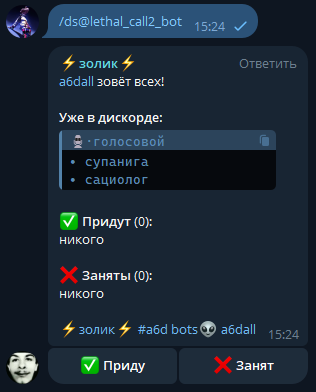

# 🤖 Zolik Bot

**Zolik Bot** — Telegram-бот, который помогает команде быстро собираться в Discord. Просто используй команду `/ds`, чтобы вызвать всех, и отслеживай, кто уже сидит в голосе, кто придёт, а кто занят.

---

## 🚀 Функциональность

### 🔔 Команда `/ds`
- Отправляет всем уведомление о сборе в Discord.
- Показывает список тех, кто **уже в голосе**.
- Включает **интерактивные кнопки**:
  - ✅ **Иду**
  - ❌ **Занят**

Пользователи могут нажать кнопку и **бот обновит сообщение**, отображая:
- кто подтвердил участие,
- кто отказался,
- кто ещё не ответил.

---

## 📦 Пример использования

Пользователь вводит в Telegram: /ds

Бот отвечает:

---

## ⚙️ Технологии

- `Python 3.10`
- `aiogram` — Telegram API
- `discord.py` / `py-cord` — для работы с голосовыми каналами
- `dotenv` — для загрузки токенов через переменные окружения
